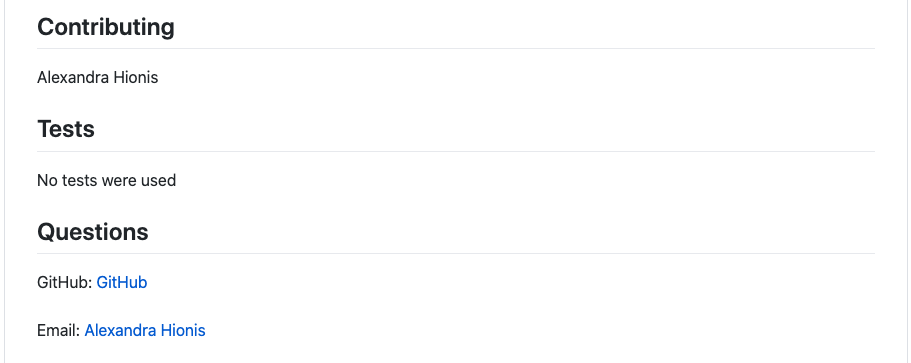

## README Generator
## Description
 User needs to generate a ReadMe file to save time and facilitate the completion of their project. They are prompted to answer a series of questions which will complete the ReadMe contents. This includes a project title, description, installation, usage, license, contributing, tests, and questions. Also, a table of contents will be made as well. A users GitHub account and email will be set up as well.
## Table of Contents
- [Description](#description)
- [Installation](#installation)
- [Usage](#usage)
- [License](#license)
- [Contributing](#contributing)
- [Tests](#tests)
- [Questions](#questions)
## Installation
node.js and Inquirer package must be installed. Also utilizes util and fs.
## Usage
A simple application where all the user needs to do is answer the prompts in their terminal/console. They quickly type out their answers and a good quality README.md will be generated. It will cut down on time and enhance the users performance on project specifics.

 https://media.giphy.com/media/eaqtFnAFebguCbpscK/source.mov
 
## License
ISC
## Contributing
[Alexandra Hionis](https://github.com/Alexandra-Hionis/README-Generator)
## Tests
No tests were used
## Questions
GitHub: https://github.com/Alexandra-Hionis  
Email: Alexandra.hionis@gmail.com  
